# CipherSwarm: Secure Concurrent P2P File Sharing System

**Course:** Operating Systems  
**Project Title:** CipherSwarm — Secure Concurrent P2P File Sharing System with Token-Based Access Control  

---

## Table of Contents

1. [Problem Statement](#1-problem-statement)
2. [System Architecture](#2-system-architecture)
3. [Implementation of OS Concepts](#3-implementation-of-os-concepts)
   - 3.1 Processes and Threads
   - 3.2 Inter-Process Communication (IPC)
   - 3.3 Shared Memory
   - 3.4 Semaphores
   - 3.5 Message Queues
   - 3.6 File Locking
   - 3.7 Mutexes and Critical Sections
   - 3.8 Sockets and Network I/O
4. [Wire Protocol](#4-wire-protocol)
5. [Security Model](#5-security-model)
6. [File Transfer Pipeline](#6-file-transfer-pipeline)
7. [Piece Scheduling Algorithm](#7-piece-scheduling-algorithm)
8. [Sample Output](#8-sample-output)
9. [Challenges Faced and Solutions](#9-challenges-faced-and-solutions)
10. [Directory Structure](#10-directory-structure)

---

## 1. Problem Statement

Designing a centralized file storage system is straightforward, but it creates a single point of failure, a bottleneck, and a trust problem — all clients must trust the server with their data. A peer-to-peer (P2P) architecture distributes these responsibilities across nodes, but introduces new challenges around access control, data integrity, and concurrent resource access.

**CipherSwarm** addresses the following problem:

> Build a decentralized P2P file sharing network where peers can upload and download files concurrently, file access is governed by cryptographically signed tokens, data integrity is verified per-piece using SHA1 hashes, and all internal coordination within a peer node uses explicit OS-level IPC primitives.

The system must satisfy these constraints:

- No per-chunk calls to the authentication server during file transfer (tokens are verified locally).
- Role-Based Access Control (RBAC) with three roles: downloader, regular, and admin.
- Each peer node must internally use processes/threads, shared memory, message queues, and semaphores.
- All file I/O must use `flock()` for safe concurrent disk access.
- The tracker server must perform stale-peer eviction automatically.

---

## 2. System Architecture

The system consists of three independent components, each running as a separate process:

```
+---------------------+        +---------------------+
|   Auth Server       |        |   Tracker Server    |
|   (port 8080)       |        |   (port 9090)       |
|                     |        |                     |
|  - Registration     |        |  - ANNOUNCE         |
|  - Login            |        |  - GET_PEERS        |
|  - Token issuing    |        |  - Stale eviction   |
|  - Torrent storage  |        |                     |
|  - Role management  |        +---------------------+
+---------------------+
          |                            |
          |  (token + torrent)         |  (peer list)
          v                            v
+---------------------------------------------------------------+
|                     Peer Node                                 |
|  - Registers and logs in with Auth Server                     |
|  - Announces file availability to Tracker                     |
|  - Serves file pieces to other peers (upload path)            |
|  - Requests and assembles pieces from other peers (download)  |
|  - Verifies token signatures locally on every piece request   |
+---------------------------------------------------------------+
```

**Authentication Server** (`auth_server/`)  
Manages user identities, issues RSA-SHA256 signed tokens, stores torrent metadata, and enforces role changes. It is the only server that holds the RSA private key.

**Tracker Server** (`tracker/`)  
A lightweight server that maps file IDs to active peer lists. Peers announce themselves periodically. The tracker runs a reaper thread that evicts peers not seen within a timeout window.

**Peer Node** (`peer/`)  
Each peer is a self-contained process with internal threads for networking, uploading, downloading, and disk I/O. A peer acts as both a client (downloader) and a server (uploader) simultaneously.

**System Startup**

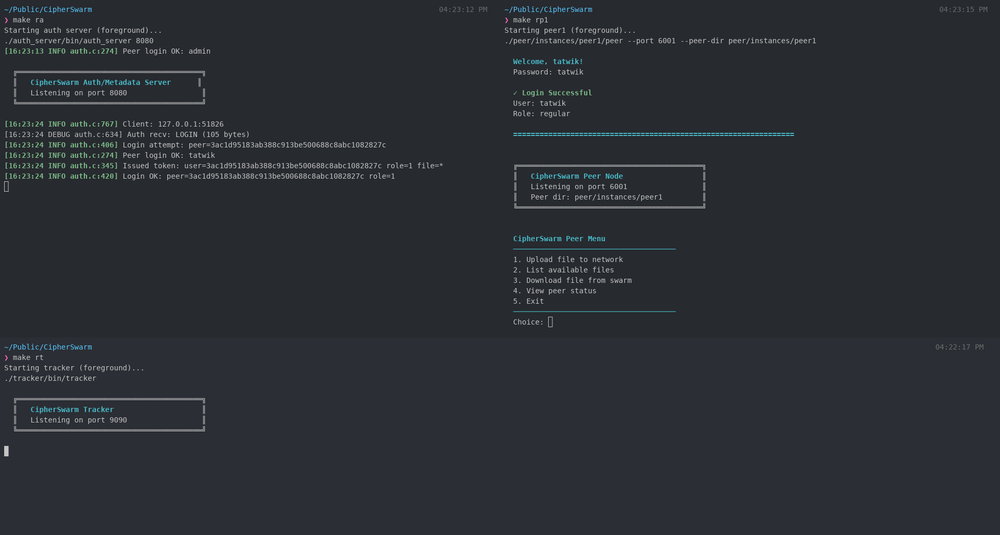

---

## 3. Implementation of OS Concepts

### 3.1 Processes and Threads

Each peer node uses `pthread` to spawn multiple concurrent threads:

| Thread | Responsibility |
|--------|---------------|
| Main thread | Menu, user interaction |
| Listener thread | `accept()` loop, handles incoming peer connections |
| Per-peer receive thread | Reads messages from each connected peer |
| Download worker thread | One per connected peer, requests and tracks pieces |
| Re-announce thread | Periodically announces seeded files to the tracker |

**Source reference:** `peer/network.c` — `peer_listener_thread()`, `peer_recv_thread()`

```c
// Spawning a receive thread per connected peer
pthread_t recv_thread;
pthread_create(&recv_thread, NULL, peer_recv_thread, pta);
pthread_detach(recv_thread);
```

The tracker also spawns a thread per client connection and a dedicated reaper thread:

```c
// tracker/tracker.c
pthread_create(&client_thread, NULL, client_handler, arg);
pthread_create(&reaper_thread, NULL, reaper_thread_fn, NULL);
```

### 3.2 Inter-Process Communication (IPC)

CipherSwarm uses all three System V IPC mechanisms — shared memory, message queues, and semaphores — within each peer node.

**Source reference:** `peer/ipc.c`, `peer/ipc.h`

All IPC resources are initialized at startup via `ipc_init()` and cleaned up on exit via `ipc_cleanup()`:

```c
int ipc_init(struct IpcResources *ipc, int total_pieces);
void ipc_cleanup(struct IpcResources *ipc);
```

### 3.3 Shared Memory

The piece bitfield — a per-file array indicating which pieces are locally available — is stored in a shared memory segment. This allows multiple threads (download workers, upload handlers, receive threads) to read and update piece availability without copying data.

```c
// peer/ipc.c — creating the shared memory segment
size_t shm_size = total_pieces * sizeof(int);
ipc->shm_id = shmget(IPC_PRIVATE, shm_size, IPC_CREAT | 0600);
ipc->shm_bitfield = (int *)shmat(ipc->shm_id, NULL, 0);
memset(ipc->shm_bitfield, 0, shm_size);
```

Access to the bitfield is protected by a semaphore (see 3.4).

```c
// Setting a piece as available (called after successful download + hash verify)
void ipc_bitfield_set(struct IpcResources *ipc, int piece_index) {
    sem_wait(ipc->sem_id, SEM_BITFIELD);
    ipc->shm_bitfield[piece_index] = 1;
    sem_post(ipc->sem_id, SEM_BITFIELD);
}
```

### 3.4 Semaphores

System V semaphores are used to synchronize access to the shared bitfield and to implement producer-consumer flow control between threads.

Three semaphores are created in a single semaphore set:

| Semaphore | Type | Initial Value | Purpose |
|-----------|------|---------------|---------|
| `SEM_BITFIELD` | Binary (mutex) | 1 | Protects shared memory bitfield |
| `SEM_MQ_FULL` | Counting | 0 | Signals items available in queue |
| `SEM_MQ_EMPTY` | Counting | 64 | Signals free slots in queue |

```c
// peer/ipc.c
ipc->sem_id = semget(IPC_PRIVATE, SEM_COUNT, IPC_CREAT | 0600);
semctl(ipc->sem_id, SEM_BITFIELD, SETVAL, 1);   // binary mutex
semctl(ipc->sem_id, SEM_MQ_FULL,  SETVAL, 0);   // producer-consumer
semctl(ipc->sem_id, SEM_MQ_EMPTY, SETVAL, 64);
```

The `sem_wait` and `sem_post` helpers wrap `semop()`:

```c
static int sem_wait(int sem_id, int sem_num) {
    struct sembuf op = { .sem_num = sem_num, .sem_op = -1, .sem_flg = 0 };
    while (semop(sem_id, &op, 1) < 0) {
        if (errno == EINTR) continue;
        return -1;
    }
    return 0;
}
```

### 3.5 Message Queues

Five System V message queues are created per peer instance to pass data between internal subsystems without shared state:

| Queue | Direction | Purpose |
|-------|-----------|---------|
| `mq_net_to_download` | Network → Download | Notify download manager of received pieces |
| `mq_download_to_disk` | Download → Disk | Queue pieces to be written to disk |
| `mq_net_to_upload` | Network → Upload | Forward piece requests to upload manager |
| `mq_upload_to_disk` | Upload → Disk | Request file reads for serving |
| `mq_disk_response` | Disk → Upload | Return read data to upload manager |

```c
// peer/ipc.c
ipc->mq_net_to_download = msgget(IPC_PRIVATE, IPC_CREAT | 0600);
ipc->mq_download_to_disk = msgget(IPC_PRIVATE, IPC_CREAT | 0600);
ipc->mq_net_to_upload    = msgget(IPC_PRIVATE, IPC_CREAT | 0600);
ipc->mq_upload_to_disk   = msgget(IPC_PRIVATE, IPC_CREAT | 0600);
ipc->mq_disk_response    = msgget(IPC_PRIVATE, IPC_CREAT | 0600);
```

Messages are sent and received using `msgsnd()` / `msgrcv()`:

```c
int ipc_send_msg(int mq_id, struct IpcMsg *msg) {
    size_t msg_size = sizeof(struct IpcMsg) - sizeof(long);
    while (msgsnd(mq_id, msg, msg_size, 0) < 0) {
        if (errno == EINTR) continue;
        return -1;
    }
    return 0;
}
```

### 3.6 File Locking

All disk reads and writes use `flock()` to prevent data corruption when multiple threads access the same file concurrently. Write operations acquire an exclusive lock; read operations acquire a shared lock.

**Source reference:** `peer/disk.c`

```c
// Write path — exclusive lock (LOCK_EX)
int write_piece(const char *filepath, int piece_index, int piece_size,
                const void *data, int data_len)
{
    int fd = open(filepath, O_WRONLY | O_CREAT, 0644);
    flock(fd, LOCK_EX);              // block until exclusive access granted
    off_t offset = (off_t)piece_index * piece_size;
    lseek(fd, offset, SEEK_SET);
    write(fd, data, (size_t)data_len);
    flock(fd, LOCK_UN);              // release lock
    close(fd);
}

// Read path — shared lock (LOCK_SH)
int read_piece(const char *filepath, int piece_index, int piece_size,
               void *buf, int buf_size)
{
    int fd = open(filepath, O_RDONLY);
    flock(fd, LOCK_SH);              // multiple readers allowed simultaneously
    lseek(fd, (off_t)piece_index * piece_size, SEEK_SET);
    read(fd, buf, (size_t)buf_size);
    flock(fd, LOCK_UN);
    close(fd);
}
```

This ensures that even when two download workers write different pieces simultaneously, and an upload thread is reading another piece, no data corruption occurs.

### 3.7 Mutexes and Critical Sections

`pthread_mutex_t` is used to protect in-memory shared state accessed by multiple threads within the same process.

Two mutexes are maintained in `PeerState`:

| Mutex | Protects |
|-------|----------|
| `piece_lock` | `piece_status[]` array and download completion flag |
| `peer_lock` | `peers[]` connected peer array and `peer_count` |

```c
// peer/main.c / peer/download.c — protecting piece assignment
pthread_mutex_lock(&state->piece_lock);
int piece = scheduler_next_piece(state, peer_idx);
if (piece >= 0) {
    state->piece_status[piece] = PIECE_DOWNLOADING;
}
pthread_mutex_unlock(&state->piece_lock);
```

This prevents two download worker threads from requesting the same piece from different peers simultaneously.

### 3.8 Sockets and Network I/O

All network communication uses TCP sockets (`SOCK_STREAM`). A custom length-prefixed framing protocol is used: every message is preceded by a 1-byte type and a 4-byte little-endian length field.

```c
// peer/common/network.c
int send_msg(int fd, uint8_t type, const void *payload, uint32_t len);
int recv_msg(int fd, uint8_t *type, void *buf, uint32_t buf_size, uint32_t *len_out);
```

The peer listener uses `SO_REUSEADDR` to allow fast restarts, and the server socket blocks in `accept()` in a dedicated thread so the main thread remains interactive.

---

## 4. Wire Protocol

All messages between components follow a binary framing format:

```
+--------+----------+-----------+
| Type   | Length   | Payload   |
| 1 byte | 4 bytes  | N bytes   |
+--------+----------+-----------+
```

### Auth Server Messages

| Message | Direction | Payload |
|---------|-----------|---------|
| `MSG_REGISTER` | Client → Server | `RegisterRequest` (username, password) |
| `MSG_REGISTER_RESP` | Server → Client | `RegisterResponse` (peer_id) |
| `MSG_LOGIN` | Client → Server | `LoginRequest` (peer_id, password) |
| `MSG_LOGIN_RESP` | Server → Client | `LoginResponse` (Token, role) |
| `MSG_UPLOAD_TORRENT` | Client → Server | `UploadTorrentRequest` (Token, Torrent) |
| `MSG_DOWNLOAD_TORRENT` | Client → Server | file_id string |
| `MSG_TORRENT_DATA` | Server → Client | `Torrent` struct |
| `MSG_AUTHZ_CHECK` | Client → Server | `AuthzCheckRequest` (Token) |
| `MSG_ACK` | Server → Client | empty |
| `MSG_ERROR` | Server → Client | error string |

### Tracker Messages

| Message | Direction | Payload |
|---------|-----------|---------|
| `MSG_ANNOUNCE` | Peer → Tracker | `AnnounceRequest` (peer_id, file_id, ip, port) |
| `MSG_GET_PEERS` | Peer → Tracker | file_id string |
| `MSG_PEER_LIST` | Tracker → Peer | count + `PeerListEntry[]` |

### Peer-to-Peer Messages

| Message | Direction | Payload |
|---------|-----------|---------|
| `MSG_HANDSHAKE` | Both | `HandshakePayload` (peer_id, file_id, listen_port) |
| `MSG_BITFIELD` | Both | `BitfieldPayload` (total_pieces, bits[]) |
| `MSG_REQUEST` | Downloader → Seeder | `RequestPayload` (piece_index, Token) |
| `MSG_PIECE` | Seeder → Downloader | `PiecePayload` (piece_index, data_len, data[]) |
| `MSG_HAVE` | Both | `HavePayload` (piece_index) |

---

## 5. Security Model

### RSA-SHA256 Token Signing

The authentication server generates an RSA-2048 key pair on first launch. When a peer logs in, the server issues a `Token` signed with the private key:

```c
struct Token {
    char          user_id[41];     // peer_id (SHA1 hex)
    char          file_id[41];     // "*" for global tokens
    int           role;            // ROLE_DOWNLOADER / REGULAR / ADMIN
    long          expiry;          // Unix timestamp
    unsigned char signature[256];  // RSA-SHA256 over the above fields
};
```

The RSA private key never leaves the auth server. The public key is distributed to peers at startup via a known path (`auth_server/keys/server_public.pem`).

### Local Token Verification

Every piece request from a downloader includes their token. The receiving peer (uploader) verifies the token **locally** without contacting the auth server:

1. Reconstruct the signed buffer (user_id + file_id + role + expiry).
2. Call OpenSSL's `RSA_verify()` with the bundled public key.
3. Check that `token.expiry > time(NULL)`.
4. Reject the request if either check fails.

This design means the auth server is not a bottleneck during active file transfers.

### Role-Based Access Control

| Role | Value | Permissions |
|------|-------|-------------|
| Downloader | 0 | Download only |
| Regular | 1 | Upload and download |
| Admin | 2 | Upload, download, manage users, view statistics |

Role changes by an admin take effect immediately. The auth server checks the **current** role from `peers.dat` on every upload attempt — not the stale role embedded in the token — so a demotion is enforced without requiring the affected peer to re-login.

---

## 6. File Transfer Pipeline

### Upload Flow

```
User selects file
       |
       v
Split into pieces (PIECE_SIZE = 256 KB)
       |
       v
SHA1 hash each piece --> store in Torrent.piece_hashes[]
       |
       v
SHA1 hash the Torrent struct --> Torrent.file_id
       |
       v
Check upload permission with Auth Server (AuthzCheckRequest)
       |
       v
Send Torrent metadata to Auth Server (UploadTorrentRequest + Token)
       |
       v
Save file to local downloads/ directory
       |
       v
Register file_id in seeding registry (.data/.seeding)
       |
       v
Announce to Tracker (ANNOUNCE with peer_id, file_id, ip, port)
       |
       v
Periodic re-announce every 60 seconds
```

### Download Flow

```
User enters file_id
       |
       v
Phase 1: Fetch Torrent metadata from Auth Server
       |
       v
Phase 2: Query Tracker for peers --> GET_PEERS(file_id)
       |
       v
Phase 3: Connect to each peer, perform HANDSHAKE
         Exchange BITFIELD (which pieces each peer has)
       |
       v
Phase 4: Spawn one download worker thread per connected peer
         Each worker calls scheduler_next_piece() for assignments
       |
       v
For each assigned piece:
  - Send REQUEST(piece_index, Token) to peer
  - Wait for PIECE response (up to 30 seconds)
  - Verify SHA1 hash against Torrent.piece_hashes[piece_index]
  - On success: write_piece() with flock(LOCK_EX), update bitfield
  - On hash mismatch: release piece, retry from another peer
  - Send HAVE(piece_index) to all connected peers
       |
       v
All pieces verified --> announce self as seeder to Tracker
```

---

## 7. Piece Scheduling Algorithm

CipherSwarm implements a **rarest-first** scheduling strategy. The scheduler is called under `piece_lock` to ensure thread safety.

**Source reference:** `peer/scheduler.c`

```
For each download worker (one per connected peer):

1. Count availability of each piece across all connected peers
   availability[i] = number of peers that have piece i

2. Among pieces that are:
   - PIECE_FREE (not yet downloaded or being downloaded)
   - Available from the target peer (remote_bitfield[i] == 1)

3. Select the piece with the LOWEST availability count
   (rarest piece is downloaded first, maximizing swarm diversity)

4. Mark it as PIECE_DOWNLOADING before releasing piece_lock
```

This strategy maximizes the value each peer provides to the swarm. Pieces that only one peer has are fetched first, reducing the risk that a peer disconnect causes a stall.

---

## 8. Sample Output

### Peer Registration and Login

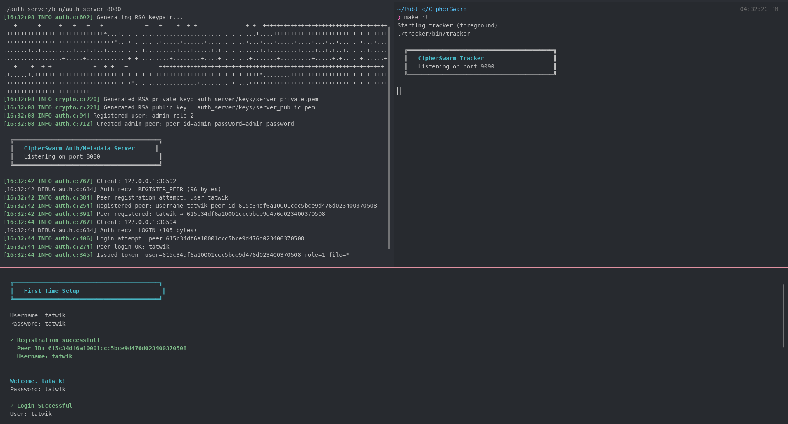

### File Upload

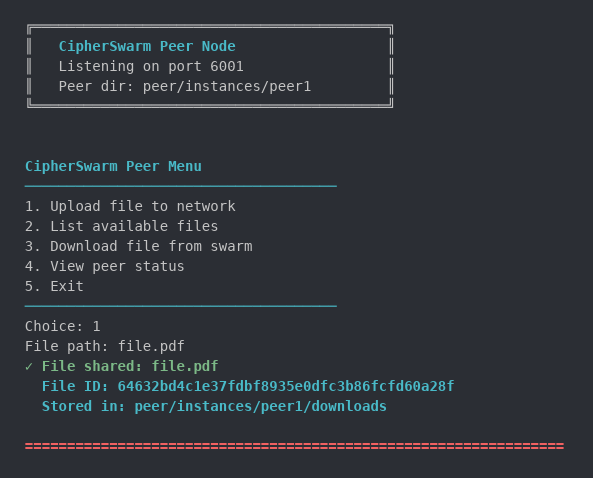

### File List

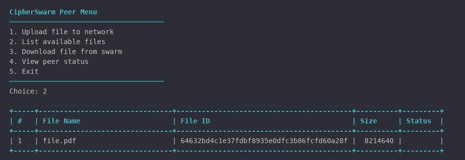

### File Download with Progress

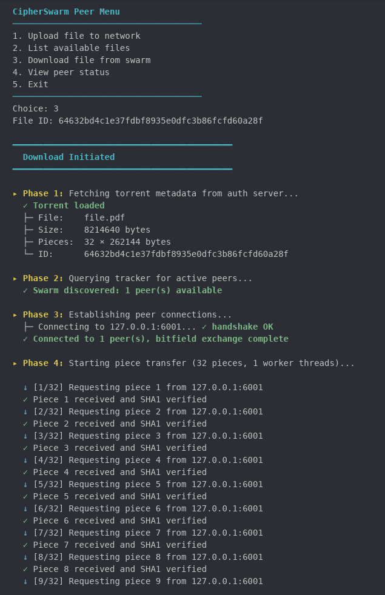

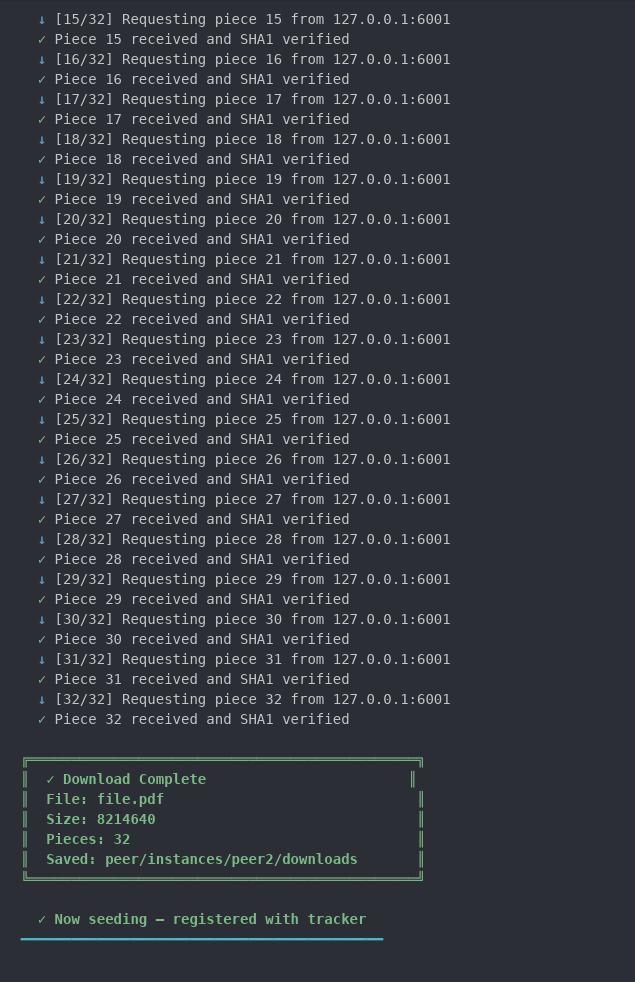

### Peer Status

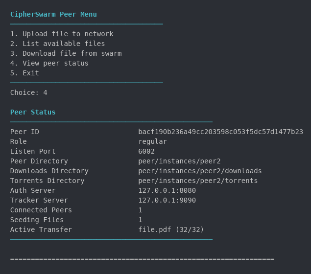

### Admin Panel

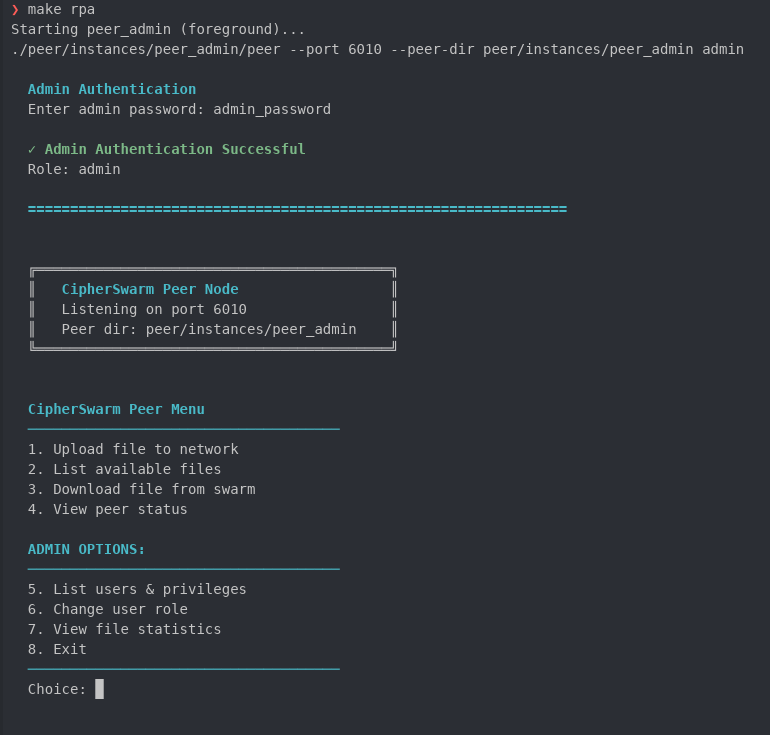


### Admin - List users

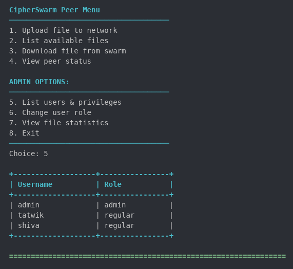


### Admin - Role Change

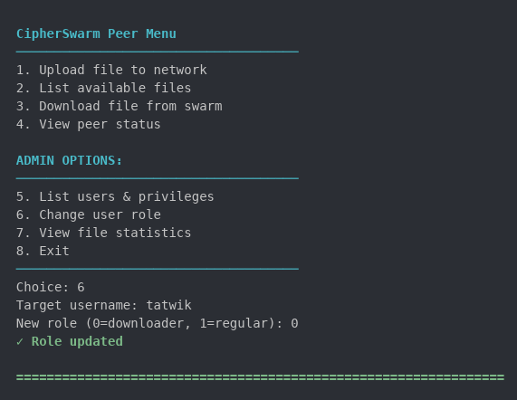

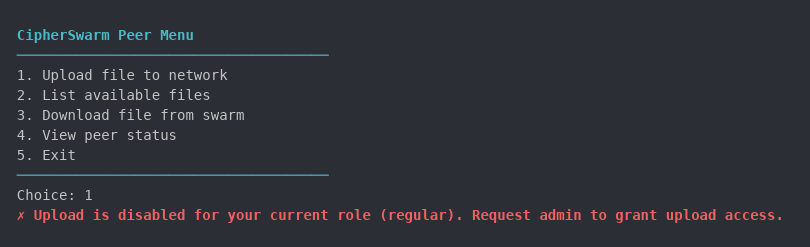

### Admin - Statistics

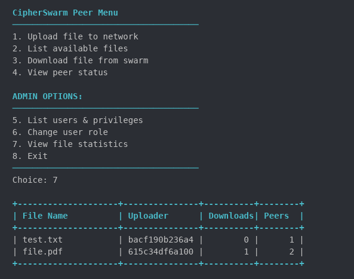


## 9. Challenges Faced and Solutions

### Challenge 1: Buffer Overflow in Peer Identity Fields

**Problem:** The `peer_id` field in multiple structures (`PeerState`, `ConnectedPeer`, `AnnounceRequest`, `HandshakePayload`) was defined as `char[MAX_USER_LEN]` (32 bytes). The actual peer ID is a SHA1 hex string — 40 characters plus a null terminator, requiring 41 bytes. When the login response was copied into this buffer, the 9 extra bytes silently overflowed into the adjacent `listen_port` and `peer_dir` fields in memory, producing garbage values such as port number 1647521849 instead of 6001.

**Solution:** Audited all structures across all three components (auth server, tracker, peer) and changed every `peer_id` field to `char[MAX_ID_LEN]` (41 bytes). Additionally, all `safe_strncpy` calls were updated to use `sizeof(buffer)` rather than hardcoded constants, so future field resizes propagate automatically.

### Challenge 2: Token User ID Truncation Breaking Role Lookups

**Problem:** Even after fixing peer ID buffers in the wire protocol structures, uploads were still being rejected with `UNKNOWN_PEER`. The auth server's `issue_token()` function still used `MAX_USER_LEN` (32 bytes) when writing the peer ID into `Token.user_id`. The token therefore carried a truncated ID. When the upload handler called `get_peer_role(req->token.user_id)` to look up the current role in `peers.dat`, the truncated ID never matched any record, so every upload returned an error.

**Solution:** Changed `Token.user_id` from `char[MAX_USER_LEN]` to `char[MAX_ID_LEN]` in all three `structs.h` files, and fixed the `safe_strncpy` in `issue_token()` to use `sizeof(token_out->user_id)`.

### Challenge 3: Role Changes Not Taking Effect on Running Peers

**Problem:** The initial implementation checked `req->token.role` to decide whether an upload was permitted. Since the token is issued at login and never refreshed, changing a user's role via the admin interface had no effect until the peer restarted and logged in again.

**Solution:** Replaced the token role check in `handle_upload_torrent()` and `handle_upload_check()` with a live lookup from `peers.dat` using the token's `user_id` as the key. The token is still verified cryptographically (to confirm the peer is who they claim to be), but the authoritative role is always read from the database at the moment of the request.

### Challenge 4: All Peers Defaulting to the Same Port

**Problem:** Every peer instance defaulted to `DEFAULT_PEER_PORT` (6001) when no `--port` argument was supplied. When the admin peer attempted to download a file, the tracker returned one peer at `127.0.0.1:6001`. The download code skips entries where `port == own_listen_port` to avoid self-connections. Since both the downloader and the seeder shared port 6001, the seeder was skipped and no connection could be established.

**Solution:** Added explicit `--port` flags to each `make` run target in the Makefile: peer1 on 6001, peer2 on 6002, peer3 on 6003, and the admin peer on 6010. This ensures each instance has a unique identity in the tracker's swarm table.

### Challenge 5: Incoming Connections Registered with Ephemeral Port

**Problem:** When a peer accepted an incoming TCP connection via `accept()`, it recorded the peer's address using the ephemeral source port returned by the kernel (e.g., 59928) rather than the peer's actual listener port (e.g., 6010). The download worker then attempted to fetch pieces from `127.0.0.1:59928`, which was not a listening port and never responded, causing indefinite timeouts on any piece assigned to that worker.

**Solution:** Added a `listen_port` field to `HandshakePayload`. The connecting peer now includes its actual listener port in the handshake message. The accepting peer reads this field and uses it when registering the connection in its peer table, replacing the ephemeral source port entirely.

---

## 10. Directory Structure

```
CipherSwarm/
|
+-- auth_server/
|   +-- auth.c              Main auth server logic (register, login, token, roles)
|   +-- metadata.c          Torrent metadata storage and retrieval
|   +-- auth_server.h       Public API
|   +-- common/
|       +-- structs.h       Shared data structures (Token, Torrent, PeerInfo, ...)
|       +-- protocol.h      Message type constants and size limits
|       +-- network.c       TCP send/recv framing
|       +-- crypto.c        RSA signing and verification via OpenSSL
|       +-- utils.c         Logging, safe string functions
|
+-- tracker/
|   +-- tracker.c           Swarm table, ANNOUNCE, GET_PEERS, reaper thread
|   +-- common/             (mirrored from auth_server/common)
|
+-- peer/
|   +-- main.c              Entry point, menu, upload/download orchestration
|   +-- network.c           Listener thread, peer handshake, recv thread, bitfield exchange
|   +-- download.c          Download worker threads, piece polling, completion detection
|   +-- upload.c            Upload handler, piece serving, token verification
|   +-- disk.c              flock-protected read_piece() and write_piece()
|   +-- scheduler.c         Rarest-first piece selection algorithm
|   +-- ipc.c               System V shared memory, message queues, semaphores
|   +-- ipc.h               IPC resource structs and constants
|   +-- torrent.c           Torrent creation (SHA1 hashing, metadata construction)
|   +-- peer.h              PeerState, ConnectedPeer, piece status constants
|   +-- common/             (mirrored from auth_server/common)
|   +-- instances/
|       +-- peer1/          Runtime data for peer instance 1
|       +-- peer2/          Runtime data for peer instance 2
|       +-- peer_admin/     Runtime data for admin peer
|
+-- Makefile                Build and run targets
+-- HOW_TO_RUN.txt          Step-by-step run instructions
+-- REPORT.md               This document
```

---
